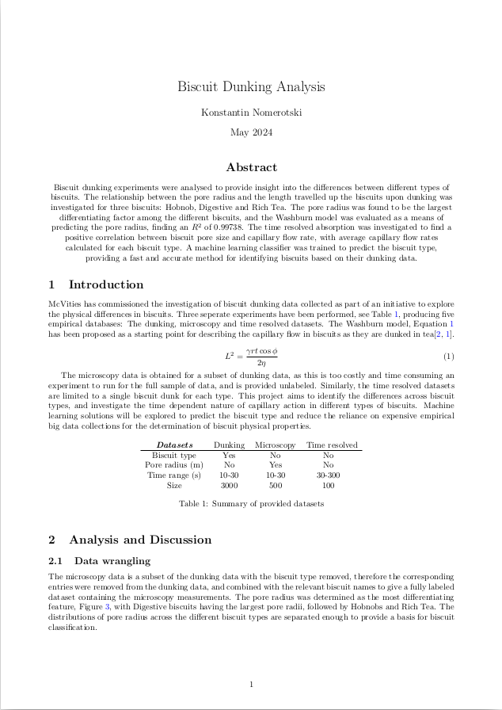

Biscuit dunking is an essential aspect of British culture, whether you're dunking chocolate coated biscuits, oat, or digestives, everyone is guilty of the occasional dunk. This can lead even to the point of rivalry, betweeen the one second dunkers and the die hard, wait as long as you can without the biscuit crumbling camp. An investigation into McVities biscuit dunking data has been conducted to clear the air on the difference between three types of biscuits: Digestives, Hobnobs, and Rich Tea. 

<h3>Project Objectives</h3>

This investigation aimed to explore the physical differences between biscuits through empirical data collected from dunking experiments. It analyzed the applicability of capillary flow action to biscuits, examining the relationship between the pore radius and capillary flow rate during dunking. This translated into insights on how tea travels up the different types of biscuit. Machine Learning methods were investigated for the classication of biscuit type, as well as for modelling the pore radius of the biscuits. 

<h3>Background</h3>

<h5>Capillary action:</h5> The primary focus of this study was the relationship between the pore radius of the biscuits and their ability to absorb liquid, which is governed by capillary action. This is the ability of a liquid to flow in narrow spaces, even against gravity, and it is heavily influenced by the physical properties of the material - in this case, biscuits. The Washburn equation, a fundemental model of capillary flow action, was found to give a good estimate of the pore radius from the available data, therefore this was used as a starting point as a pore radius predictor

<h5>Biscuit Classification:</h5> 

Biscuit classification was attempted with and without the pore radius, finding greatly improved classification with the pore radius included. Both Supervised and Unsupervised methods were used, K-means clustering was attempted, however it was found to misinterpret Rich Tea for Hobnobs, and vice versa. A tuned Random Forest Classifier was found to be the best supervised predictor of biscuit type, with a 93.5 % minimum accuracy for Hobnobs, ranging to 100 % accuracy for Digestive biscuits

<h5>Regression..</h5>

<h3>Results</h3>

<ul>
<li>Performed exploratory data analysis (EDA) to clean and interpret experimental biscuit dunking data.</li>
<li>Used Regression models, such as the Washburn model, Kernel Ridge Regression, and Random Forest Regression to predict the pore size of biscuits.</li>
<li>Trained a Random Forest Classifier with an average 96 % accuracy across biscuit types.</li>
</ul>
<!--more-->

  

    
    <h3>Read the Report</h3>
    
Access the detailed report for insights.

    <a href="biscuit-report" class="call-to-action">Read Report</a>
  

  

    

    <h3>See the Code</h3>
  

<h3>Other Projects</h3>
