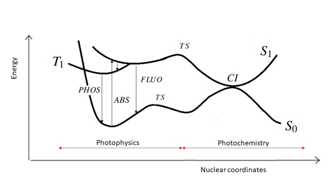
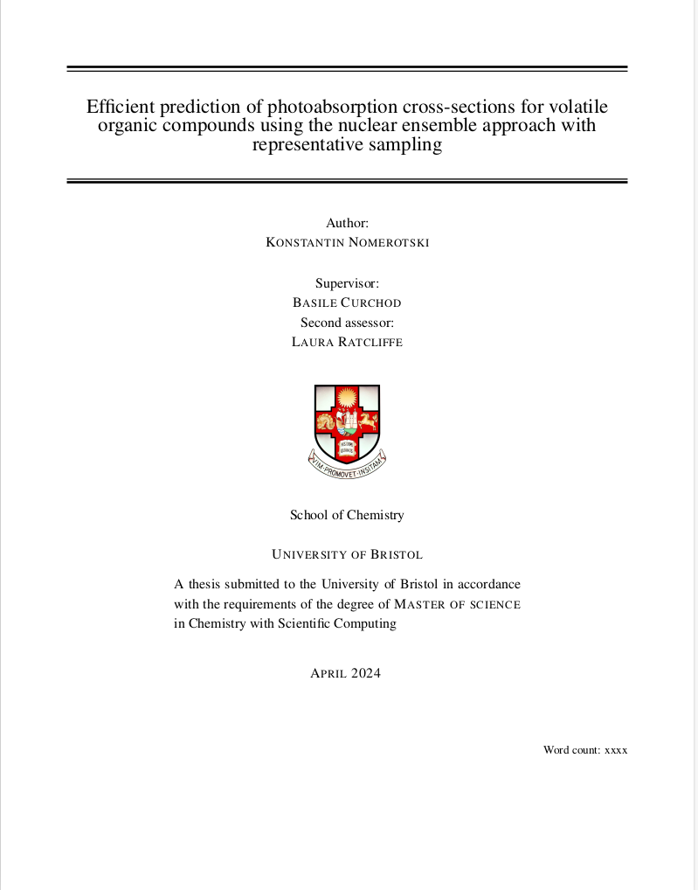

Masters thesis project at the University of Bristol <a href="https://in-silico-photochem.com/">InSilicoPhotochemistry</a> group

<h3>Project Objectives</h3>

The primary aim of this thesis was to implement optimal sampling of a representative nuclear ensemble using simulated annealing within the Atmospec workchain. This approach seeks to provide a fast and efficient method for exploring the photoabsorption cross-sections of gas-phase Volative Organic Compounds.

<h3>Background</h3>

<h5>Photoabsorption Cross-Sections:</h5> 

Photoabsorption cross-sections are fundamental parameters that quantify the likelihood of a photon being absorbed by a molecule. They play a crucial role in atmospheric chemistry and photochemistry. They help us understand how volatile organic compounds (VOCs) interact with light, which is essential for modeling atmospheric processes, predicting the behavior of pollutants, and assessing their impact on climate and air quality.

<h5>Challenges in Calculation:</h5> 

The traditional methods for calculating photoabsorption cross-sections often rely on quantum mechanical approaches, which can be computationally intensive. These methods typically require the evaluation of a large number of nuclear geometries to capture the full range of molecular conformations that contribute to the absorption spectrum. As the complexity of the molecule increases, the number of required calculations can grow exponentially, making it computationally prohibitive to obtain accurate results for larger or more complex VOCs.

The Nuclear Ensemble Approach is a powerful technique that allows for the consideration of multiple nuclear configurations simultaneously. By averaging over a large ensemble of molecular geometries, this method can provide a more accurate representation of the system's behavior. However, the requirement for thousands of nuclear geometries poses significant challenges in terms of computational resources and time, particularly for complex molecules.

<h5>Representative Sampling:</h5>

Representative sampling aims to reduce the number of nuclear geometries needed in an ensemble to reduce the computational burden of photoabsorption cross-section calculations. It runs an initial exploratory calculation using a large ensemble (> 1000), then iteratively reduces the ensemble size using Simulated Annealing and Kullbeck-Leibler divergence algorithms. The overall aim is the minimize the number of geometries while retaining the most information within the ensemble as possible.

<h3>Results</h3>

Representative sampling method within the Nuclear Ensemble Approach was successfully implemented. 

<ul>
<li>Significantly reduced computational burden associated with photoabsorption cross-section calculation. This allows for the efficient exploration of larger and more complex molecules.</li>
<li>Spectra calculated using reduced ensemble effectively capture the essential features of the photoabsorption cross-sections.</li>
<li>Demonstrated robustness across multiple Volatile Organic Compounds.</li>
</ul>
<!--more-->

  

    
    <h3>Read my thesis</h3>
    
The Efficient Calcultion of Absorption cross-sections for Volatile Organic Compounds.

    <a href="thesis-report" class="call-to-action">Read Report</a>
  

  

    

    <h3>See the Code</h3>
  

<h3>Other Projects</h3>

